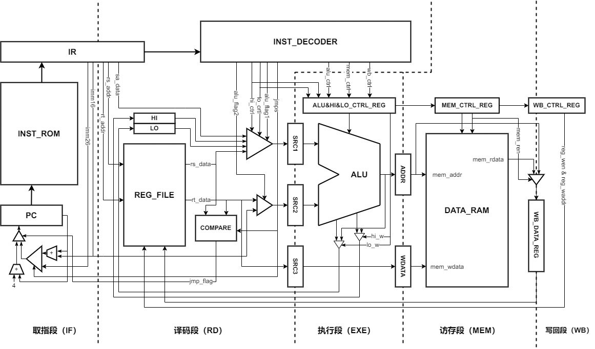

# Pipeline CPU

**《计算机组成原理》课程设计，基于 MIPS 系统的流水线 CPU 设计**

## 项目简介

本项目采用 Verilog 语言，实现了一个基于 MIPS 五级流水线 CPU 架构，且具有数据旁路机制解决数据冲突，总体结构框图如下：



### 指令集

本项目基于 MIPS 指令集，实现了 39 种不同的指令，指令的格式和编码与 MIPS 指令集保持一致。

| 汇编指令             | 指令码                                     | 功能描述                                          |
|:----------------:|:---------------------------------------:|:---------------------------------------------:|
| add Rd, Rs, Rt   | 000000\|Rs\|Rt\|Rd\|00000\|100000       | RF[Rd] = RF[Rs] + RF[Rt]                      |
| and Rd, Rs, Rt   | 000000\|Rs\|Rt\|Rd\|00000\|100100       | RF[Rd] = RF[Rs] & RF[Rt]                      |
| jr Rs            | 000000\|Rs\|00000\|00000\|00000\|001000 | PC = RF[Rs]                                   |
| mfhi Rd          | 000000\|00000\|00000\|Rd\|00000\|010000 | RF[Rd] = HI                                   |
| mflo Rd          | 000000\|00000\|00000\|Rd\|00000\|010010 | RF[Rd] = LO                                   |
| mthi Rs          | 000000\|Rs\|00000\|00000\|00000\|010001 | HI = RF[Rs]                                   |
| mtlo Rs          | 000000\|Rs\|00000\|00000\|00000\|010011 | LO = RF[Rs]                                   |
| mult Rs, Rt      | 000000\|Rs\|Rt\|00000\|00000\|011000    | HI \| LO = RF[Rs] * RF[Rt]                    |
| nor Rd, Rs, Rt   | 000000\|Rs\|Rt\|Rd\|00000\|100111       | RF[Rd] = ~(RF[Rs] \| RF[Rt])                  |
| or Rd, Rs, Rt    | 000000\|Rs\|Rt\|Rd\|00000\|100101       | RF[Rd] = RF[Rs] \| RF[Rt]                     |
| sll Rd, Rt, sa   | 000000\|00000\|Rt\|Rd\|sa\|100111       | RF[Rd] = RF[Rt] << sa                         |
| sllv Rd, Rt, Rs  | 000000\|Rs\|Rt\|Rd\|00000\|000100       | RF[Rd] = RF[Rt] << RF[Rs]                     |
| slt Rd, Rs, Rt   | 000000\|Rs\|Rt\|Rd\|00000\|101010       | RF[Rd] = (RF[Rs] < RF[Rt]) ? 1 : 0            |
| sra Rd, Rt, sa   | 000000\|00000\|Rt\|Rd\|sa\|000011       | RF[Rd] = RF[Rt] >>> sa                        |
| srav Rd, Rt, Rs  | 000000\|Rs\|Rt\|Rd\|00000\|000111       | RF[Rd] = RF[Rt] >>> RF[Rs]                    |
| srl Rd, Rt, sa   | 000000\|00000\|Rt\|Rd\|sa\|000010       | RF[Rd] = RF[Rt] >> sa                         |
| srlv Rd, Rt, Rs  | 000000\|Rs\|Rt\|Rd\|00000\|000110       | RF[Rd] = RF[Rt] >> RF[Rs]                     |
| sub Rd, Rs, Rt   | 000000\|Rs\|Rt\|Rd\|00000\|100010       | RF[Rd] = RF[Rs] - RF[Rt]                      |
| xor Rd, Rs, Rt   | 000000\|Rs\|Rt\|Rd\|00000\|100110       | RF[Rd] = RF[Rs] ^ RF[Rt]                      |
| addi Rt, Rs, imm | 001000\|Rs\|Rt\|imm                     | RF[Rt] = RF[Rs] + imm                         |
| andi Rt, Rs, imm | 001100\|Rs\|Rt\|imm                     | RF[Rt] = RF[Rs] & imm                         |
| beq Rs, Rt, imm  | 000100\|Rs\|Rt\|imm                     | if RF[Rs] == RF[Rt]: PC = PC + imm << 2       |
| bgez Rs, imm     | 000001\|Rs\|00001\|imm                  | if RF[Rs] >= 0: PC = PC + imm << 2            |
| bgtz Rs, imm     | 000111\|Rs\|00000\|imm                  | if RF[Rs] > 0: PC = PC + imm << 2             |
| blez Rs, imm     | 000110\|Rs\|00000\|imm                  | if RF[Rs] <= 0: PC = PC + imm << 2            |
| bltz Rs, imm     | 000001\|Rs\|00000\|imm                  | if RF[Rs] < 0: PC = PC + imm << 2             |
| bne Rs, Rt, imm  | 000101\|Rs\|Rt\|imm                     | if RF[Rs] != RF[Rt]: PC = PC + imm << 2       |
| lb Rt, imm(Rs)   | 100000\|Rs\|Rt\|imm                     | RF[Rt] = MEM[RF[Rs] + imm]                    |
| lh Rt, imm(Rs)   | 100001\|Rs\|Rt\|imm                     | RF[Rt] = MEM[RF[Rs] + imm]                    |
| lui Rt, imm      | 001111\|Rs\|Rt\|imm                     | RF[Rt] = imm << 16 \| 0x0000                  |
| lw Rt, imm(Rs)   | 100011\|Rs\|Rt\|imm                     | RF[Rt] = MEM[RF[Rs] + imm]                    |
| ori Rt, Rs, imm  | 001101\|Rs\|Rt\|imm                     | RF[Rt] = RF[Rs] \| imm                        |
| sb Rt, imm(Rs)   | 101000\|Rs\|Rt\|imm                     | MEM[RF[Rs] + imm] = RF[Rt]                    |
| sh Rt, imm(Rs)   | 101001\|Rs\|Rt\|imm                     | MEM[RF[Rs] + imm] = RF[Rt]                    |
| slti Rt, Rs, imm | 001010\|Rs\|Rt\|imm                     | RF[Rt] = (RF[Rs] < imm) ? 1 : 0               |
| sw Rt, imm(Rs)   | 101011\|Rs\|Rt\|imm                     | MEM[RF[Rs] + imm] = RF[Rt]                    |
| xori Rt, Rs, imm | 001110\|Rs\|Rt\|imm                     | RF[Rt] = RF[Rs] ^ imm                         |
| j imm            | 000010\|imm                             | PC = PC[31:28] \| imm << 2                    |
| jal imm          | 000011\|imm                             | RF[$ra] = PC + 4;  PC = PC[31:28] \| imm << 2 |

### 算术逻辑单元 ALU

ALU 模块由一个加法器、一个乘法器和一个 4-16 译码器构成，实现 12 种不同的运算，控制信号采用全译码法。

| 运算操作名称 | 控制信号编码 | 运算操作名称   | 控制信号编码 |
|:------:|:------:|:--------:|:------:|
| 加法     | 0001   | 按位或非     | 0111   |
| 减法     | 0010   | 逻辑左移     | 1000   |
| 小于条件设置 | 0011   | 逻辑右移     | 1001   |
| 按位与    | 0100   | 算术右移     | 1010   |
| 按位或    | 0101   | 立即数写入高半字 | 1011   |
| 按位异或   | 0110   | 乘法       | 1100   |

### 寄存器堆

寄存器堆内部共有 32 个通用寄存器，其中零号寄存器的值被硬编码为零，用于提供常数零。寄存器堆模块共有两个读端口用于同时读取两个操作数、一个写端口用于数据的写回以及两个测试读端口用于展示程序运行状态。

### 数据 RAM 存储器

- 数据 RAM 存储器共有 4KB 的存储空间，且内存按字节编址。
- 基于 Xilinx 提供的 RAM 双端口存储器 IP 核构建，由 4 个 1024 × 8bit 的 RAM 作位拓展组合而成。
- 支持 8 位（字节）、16 位（半字）、32 位（字）数据的读写。
- 不同位数数据读写的内存地址需要满足整数边界的要求。
- 双端口分别用于正常数据读写和测试读数据。

### 指令译码器

指令译码器根据指令的格式进行匹配，生成所实现的所有指令的独热编码，组合得到 CPU 内部各个模块所需的控制信号。

| 控制信号             | 描述                                                                                                                |
|:----------------:|:----------------------------------------------------------------------------------------------------------------- |
| jumps[8:0]       | 所实现的 9 种不同的分支跳转指令独热编码                                                                                             |
| alu_control[3:0] | ALU 模块控制信号                                                                                                        |
| alu_flag1        | ALU 源操作数 1 来源：<br/>取 0 表示来自 Rs 寄存器值<br/>取 1 表示来自指令 sa 段的值                                                         |
| alu_flag2        | ALU 源操作数 2 来源：<br/>取 0 表示来自Rt寄存器值 <br/>取 1 表示来自指令中的 16 位立即数                                                       |
| mem_ren[1:0]     | 数据 RAM 模块读使能信号                                                                                                    |
| mem_wen[1:0]     | 数据 RAM 模块写使能信号                                                                                                    |
| wb_flag          | 是否需要写回：<br/>取 0 表示不需要写回 <br/>取 1 表示需要写回                                                                           |
| wb_addr[4:0]     | 写回的目的寄存器地址                                                                                                        |
| hi_control[1:0]  | 专用寄存器 HI 控制信号：<br/>取 00 表示无操作<br/>取 01 表示需要读 HI 寄存器<br/>取 10 表示需要向 HI 寄存器写入某个通用寄存器值<br/>取 11 表示需要向 HI 寄存器写入乘法运算结果 |
| lo_control[1:0]  | 专用寄存器 LO 控制信号：<br/>取 00 表示无操作<br/>取 01 表示需要读 LO 寄存器<br/>取 10 表示需要向 LO 寄存器写入某个通用寄存器值<br/>取 11 表示需要向 LO 寄存器写入乘法运算结果 |

### 数据冲突检测与数据旁路

- CPU 内部维护一个队列用于记录前两条指令的写回寄存器地址。

- 若源操作数寄存器地址位于队列种则存在数据冲突。

- 根据寄存器地址在队列中的位置选择来自 ALU 或者 MEM 的旁路数据。

- 读 RAM 指令的特殊性使得在其之后的指令若存在数据冲突需要插入空操作或进行指令调度，因为此类指令 ALU 计算的实际上是内存地址（本人正在考虑是否需要添加针对此类指令的流水线暂停机制）。

## 使用说明

*<u>本项目使用 Xilinx Vivado 2019.1 开发</u>*

- 本项目提供了 4 段测试程序，详见测试用例说明。

- 可通过为 instrom 模块更换不同的 coe 文件更改当前 CPU 执行的程序，也可将自定义的测试程序写入新的 coe 文件加载到 instrom 模块中。

- 根据需要修改 testbench.v 文件，CPU 提供两个寄存器测试读端口和一个 RAM 测试读端口，可以利用它们检查程序在 CPU 内部的运行状态。

### 测试用例说明

测试程序 1 为指令功能测试，指令机器码与对应的汇编程序如下。

```
34010003  ori $1, $0, 3
34020005  ori $2, $0, 5
0C00001C  jal 28
00000000  nop
00200011  mthi $1
00400013  mtlo $2
00002010  mfhi $4
00002812  mflo $5
A0010000  sb $1, 0($0)
A4020002  sh $2, 2($0)
AC030004  sw $3, 4($0)
80060000  lb $6, 0($0)
84060002  lh $6, 2($0)
8C060004  lw $6, 4($0)
10220002  beq $1, $2, 2
00000000  nop
04210003  bgez $1, 3
00000000  nop
1C200007  bgtz $1, 7
00000000  nop
18200004  blez $1, 4
00000000  nop
0420FFFB  bltz $1, -5
00000000  nop
1422FFF9  bne $1, $2, -7
00000000  nop
08000064  j 100
00000000  nop
00221820  add $3, $1, $2
20230001  addi $3, $1, 1
00221824  and $3, $1, $2
30230002  andi $3, $1, 2
00221827  nor $3, $1, $2
00221825  or $3, $1, $2
00021867  sll $3, $2, 1
00221804  sllv $3, $2, $1
0022182A  slt $3, $1, $2
28230002  slti $3, $1, 2
00021843  sra $3, $2, 1
00221807  srav $3, $2, $1
00021882  srl $3, $2, 2
00221806  srlv $3, $2, $1
00221822  sub $3, $1, $2
00221826  xor $3, $1, $2
3823000C  xori $3, $1, 12
00220018  mult $1, $2
03E00008  jr $ra
00000000  nop
```

测试程序 2 为阶乘求解，求解 5 的阶乘值，指令机器码与对应的汇编程序如下。

```
34010001  ori $1, $0, 1
34020005  ori $2, $0, 5
00220018  mult $1, $2
00000812  mflo $1
2042FFFF  addi $2, $2, -1
1C40FFFC  bgtz $2, -4
00000000  nop
```

测试程序 3 为斐波那契数列求解，求解斐波那契数列的前 10 项，指令机器码与对应的汇编程序如下。

```
34010001  ori $1, $0, 1
34020000  ori $2, $0, 0
3403000A  ori $3, $0, 10
00222020  add $4, $1, $2
00011025  or $2, $0, $1
00040825  or $1, $0, $4
2063FFFF  addi $3, $3, -1
1C60FFFB  bgtz $3, -5
00000000  nop
```

测试程序 4 为冒泡排序算法，实现 RAM 中长度为 5 的数组排序，指令机器码与对应的汇编程序如下。

```
340B0054  ori $11, $0, 84
340C0007  ori $12, $0, 7
340DFFF1  ori $13, $0, -15
340E0015  ori $14, $0, 21
340FFFFA  ori $15, $0, -6
AC0B0000  sw $11, 0($0)
AC0C0004  sw $12, 4($0)
AC0D0008  sw $13, 8($0)
AC0E000C  sw $14, 12($0)
AC0F0010  sw $15, 16($0)
34010000  ori $1, $0, 0
34020010  ori $2, $0, 16
34030000  ori $3, $0, 0
00412022  sub $4, $2, $1
8C650000  lw $5, 0($3)
8C660004  lw $6, 4($3)
00000000  nop
00C5382A  slt $7, $6, $5
10E00003  beq $7, $0, 3
00000000  nop
AC660000  sw $6, 0($3)
AC650004  sw $5, 4($3)
20630004  addi $3, $3, 4
1464FFF6  bne $3, $4, -10
00000000  nop
20210004  addi $1, $1, 4
1422FFF1  bne $1, $2, -15
00000000  nop
```
